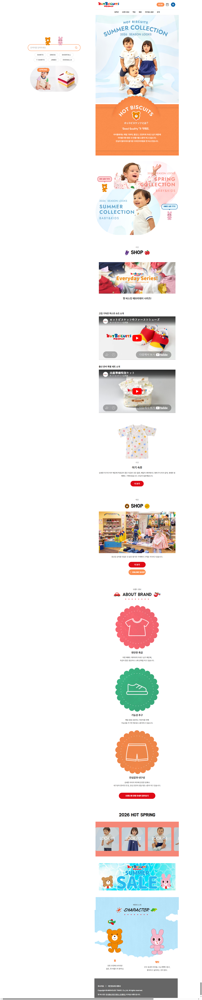

# 📌 프로젝트명

<!-- 예시: HOT BISCUITS MIKIHOUSE 리뉴얼 쇼핑몰 웹사이트 -->
> 프로젝트를 한 줄로 소개합니다.  
> 예시: 키즈 의류 브랜드의 랜딩 페이지, 컬렉션 페이지, 회원 기능, 장바구니, 결제 흐름을 구현한 웹 프로젝트입니다.

<br />

## 1. 프로젝트 소개

<!-- 프로젝트의 목적, 배경, 핵심 가치를 간단히 작성하세요. -->

### ✨ Summary

| 항목 | 내용 |
|---|---|
| 프로젝트명 | `프로젝트명 입력` |
| 프로젝트 유형 | `예: 웹사이트 / 쇼핑몰 / 대시보드 / 앱 / 게임` |
| 주요 목적 | `예: 브랜드 소개 및 상품 구매 경험 제공` |
| 핵심 키워드 | `React`, `Vite`, `Firebase`, `Responsive UI` |

<br />

## 2. Before / After 이미지

<!-- 본 프로젝트는 기존 페이지와 큰 시각적 차이를 비교하기보다, 여러 섹션을 하나의 일체형 웹페이지로 구성한 결과 화면을 중심으로 보여줍니다. -->
<!-- 이미지 교체 시 아래 경로만 프로젝트 이미지 경로에 맞게 수정하세요. -->

### 🖼️ 최종 일체형 웹페이지



<!-- Before / After 비교가 필요한 프로젝트라면 아래 표를 사용하세요. -->
<!--
| Before | After |
|---|---|
|  |  |
-->

<br />

## 3. 주의사항

<!-- 프로젝트 실행 전 알아야 할 점을 작성하세요. -->

- ⚠️ `.env` 파일은 보안상 GitHub에 포함하지 않습니다.
- ⚠️ 외부 API, 인증, 결제 기능은 별도 계정 설정이 필요할 수 있습니다.
- ⚠️ 이미지 또는 에셋 경로가 다를 경우 화면이 정상적으로 보이지 않을 수 있습니다.
- ⚠️ 배포 환경에서는 환경 변수를 반드시 등록해야 합니다.

<br />

## 4. 프로젝트 정보

### 담당 역할

<!-- 본인이 맡은 역할을 작성하세요. -->

| 역할 | 상세 내용 |
|---|---|
| 기획 | `예: 페이지 구조 설계, 사용자 흐름 정의` |
| 디자인 | `예: 레이아웃 구성, 반응형 UI 설계` |
| 프론트엔드 | `예: React 컴포넌트 구현, 상태 관리` |
| 백엔드/연동 | `예: Firebase 인증, 결제 링크 연동` |
| 배포 | `예: Vercel 배포 및 GitHub 관리` |

### 작업 기간

```text
YYYY.MM.DD ~ YYYY.MM.DD
```

### 기여도

```text
개인 프로젝트: 100%
팀 프로젝트: 예) 기획 30% / 프론트엔드 70%
```

<br />

## 5. 기술 스택

<!-- 사용 기술을 프로젝트에 맞게 수정하세요. -->

| 분류 | 기술 |
|---|---|
| Frontend | `React`, `Vite`, `JavaScript` |
| Styling | `CSS`, `Responsive Web` |
| State Management | `useState`, `useEffect`, `localStorage` |
| Auth | `Firebase Authentication` |
| Payment | `Polar Checkout` |
| Deployment | `Vercel`, `GitHub` |
| Tooling | `Git`, `npm`, `Oxlint` |

<br />

## 6. AI 활용

### 사용한 AI 도구

<!-- 사용한 AI 도구를 작성하세요. -->

- 🤖 `ChatGPT`
- 🤖 `Codex`
- 🤖 `Claude`
- 🤖 기타: `사용 도구 입력`

### AI 활용 내용

<!-- AI를 어떻게 활용했는지 작성하세요. -->

- 프로젝트 구조 설계 보조
- 컴포넌트 설계 및 코드 개선 아이디어 도출
- CSS 레이아웃 문제 해결
- README 및 문서 작성 보조
- 오류 원인 분석 및 디버깅 방향 제안

### 직접 구현한 내용

<!-- 본인이 직접 판단하고 구현한 내용을 강조하세요. -->

- 사용자 요구사항 정리 및 기능 우선순위 결정
- UI 흐름 및 페이지 구성 결정
- 실제 코드 적용 및 테스트
- 이미지/데이터/링크 연결 확인
- 배포 및 최종 검수

<br />

## 7. 프로젝트 링크

<!-- 실제 링크로 수정하세요. -->

| 구분 | 링크 |
|---|---|
| 배포 URL | [프로젝트 바로가기](https://example.com) |
| GitHub Repository | [GitHub 저장소](https://github.com/username/repository) |
| 시연 영상 | [Demo Video](https://example.com) |
| 기획 문서 | [Planning Docs](https://example.com) |

<br />

## 8. 프로젝트 개요

<!-- 프로젝트의 전체 흐름을 간단히 설명하세요. -->

이 프로젝트는 `프로젝트 목적`을 위해 제작되었습니다.  
사용자는 `주요 사용자 행동`을 수행할 수 있으며, 프로젝트는 `핵심 기능`을 중심으로 구성되어 있습니다.

### 주요 목표

- [ ] 브랜드/서비스의 핵심 정보 전달
- [ ] 사용자가 쉽게 탐색할 수 있는 UI 구현
- [ ] 핵심 기능의 실제 동작 구현
- [ ] 반응형 환경 대응
- [ ] 배포 가능한 완성도 확보

<br />

## 9. 주요 기능

<!-- 실제 구현 기능으로 수정하세요. -->

| 기능 | 설명 | 구현 여부 |
|---|---|---|
| 메인 페이지 | 서비스/브랜드 소개 영역 구성 | ✅ |
| 상품 목록 | 상품 데이터 기반 목록 출력 | ✅ |
| 상세 페이지 | 선택한 항목의 상세 정보 제공 | ✅ |
| 검색 기능 | 키워드 기반 항목 검색 | ✅ |
| 로그인/회원가입 | 인증 기능 제공 | ✅ |
| 장바구니 | 상품 담기, 수량 조절, 삭제 | ✅ |
| 관심상품 | 관심 상품 저장 및 삭제 | ✅ |
| 최근 본 상품 | 사용자 조회 기록 표시 | ✅ |
| 결제 연결 | 외부 결제 링크 연동 | ✅ |
| 반응형 UI | 모바일/태블릿/데스크톱 대응 | ✅ |

<br />

## 10. 핵심 구현 내용

<!-- 프로젝트의 기술적 핵심을 요약하세요. -->

### 1. 컴포넌트 기반 구조

```text
페이지 단위와 UI 단위를 컴포넌트로 분리하여 유지보수성을 높였습니다.
```

### 2. 상태 기반 화면 전환

```jsx
const [page, setPage] = useState('home')
```

- 별도 라우터 없이 상태값으로 페이지 전환
- 조건부 렌더링으로 화면 분기
- 사용자 흐름에 맞는 페이지 이동 처리

### 3. 사용자 액션 데이터 관리

```jsx
const [cartItems, setCartItems] = useState([])
const [favoriteItems, setFavoriteItems] = useState([])
const [recentItems, setRecentItems] = useState([])
```

- 장바구니
- 관심상품
- 최근 본 상품
- 로그인 상태에 따른 접근 제어

### 4. 외부 서비스 연동

```text
Firebase Authentication, 결제 링크, 배포 플랫폼 등을 연동했습니다.
```

<br />

## 11. Trouble Shooting

<!-- 실제 문제와 해결 과정을 작성하세요. -->

| 문제 | 원인 | 해결 |
|---|---|---|
| 이미지가 보이지 않음 | 파일명 대소문자 또는 경로 불일치 | 실제 파일명 확인 후 경로 수정 |
| 레이아웃 깨짐 | 고정 너비와 반응형 조건 충돌 | 미디어쿼리 및 grid/flex 조정 |
| 새로고침 시 데이터 초기화 | 상태값만 사용 | 필요한 데이터는 localStorage 저장 |
| 배포 환경 오류 | 환경 변수 누락 | Vercel 환경 변수 등록 |
| 버튼 클릭 미동작 | 실제 섹션 id와 링크 불일치 | 앵커 및 이벤트 핸들러 수정 |

<br />

## 12. 성능 최적화

<!-- 프로젝트에 적용한 최적화 내용을 작성하세요. -->

- 이미지 경로를 `public` 기준으로 정리
- 불필요한 중복 상태 최소화
- 컴포넌트 단위 CSS 분리
- 필요한 데이터만 렌더링
- 반복 UI는 배열 데이터 기반으로 출력
- 빌드 결과 확인을 통한 배포 안정성 검증

```bash
npm run build
```

<br />

## 13. 데이터 구조

<!-- 실제 데이터 구조 예시로 수정하세요. -->

```js
const products = [
  {
    id: 'product-01',
    name: '상품명',
    price: 29000,
    image: '/images/product.png',
    checkoutUrl: 'https://example.com/checkout',
    keywords: ['검색어1', '검색어2'],
  },
]
```

### 데이터 설계 기준

- `id`: 고유 식별자
- `name`: 화면 표시용 이름
- `price`: 가격
- `image`: 이미지 경로
- `checkoutUrl`: 결제 링크
- `keywords`: 검색 기능용 키워드

<br />

## 14. 프로젝트 구조

<!-- 실제 프로젝트 구조에 맞게 수정하세요. -->

```text
project-root/
├── public/
│   └── images/
├── src/
│   ├── components/
│   │   ├── Header/
│   │   ├── Footer/
│   │   ├── Modal/
│   │   └── ...
│   ├── data/
│   │   └── data.js
│   ├── App.jsx
│   ├── main.jsx
│   └── firebase.js
├── .env
├── package.json
└── README.md
```

<br />

## 15. 실행 방법

<!-- 프로젝트 실행 방법을 작성하세요. -->

### 1. 저장소 클론

```bash
git clone https://github.com/username/repository.git
```

### 2. 프로젝트 폴더 이동

```bash
cd project-folder
```

### 3. 패키지 설치

```bash
npm install
```

### 4. 환경 변수 설정

```env
VITE_API_KEY=your_api_key
VITE_AUTH_DOMAIN=your_auth_domain
VITE_PROJECT_ID=your_project_id
```

### 5. 개발 서버 실행

```bash
npm run dev
```

### 6. 빌드

```bash
npm run build
```

<br />

## 16. 개선 예정

<!-- 앞으로 개선할 내용을 체크리스트로 작성하세요. -->

- [ ] 실제 운영 결제 환경 연결
- [ ] 관리자 상품 등록 기능 추가
- [ ] 상품 필터 및 정렬 기능 개선
- [ ] 사용자 주문 내역 페이지 추가
- [ ] 관심상품/최근 본 상품 영구 저장
- [ ] 접근성 개선
- [ ] SEO 메타 태그 정리
- [ ] 테스트 코드 추가

<br />

## 17. 프로젝트를 통해 배운 점

<!-- 기술적/협업적/문제 해결 측면에서 작성하세요. -->

- 컴포넌트 단위로 UI를 나누면 유지보수가 쉬워진다는 점을 배웠습니다.
- 사용자 흐름을 먼저 설계해야 기능 구현이 안정적으로 진행된다는 점을 경험했습니다.
- 배포 환경에서는 로컬과 다른 문제가 발생할 수 있어 환경 변수와 경로 관리가 중요하다는 점을 배웠습니다.
- AI를 활용하더라도 최종 판단과 검증은 개발자가 직접 해야 한다는 점을 체감했습니다.

<br />

## 18. 프로젝트 회고

<!-- 프로젝트를 마친 후 느낀 점, 아쉬운 점, 다음 목표를 작성하세요. -->

이번 프로젝트를 통해 `기획 → 구현 → 테스트 → 배포`까지의 전체 흐름을 경험했습니다.  
특히 사용자가 실제로 사용할 수 있는 기능을 중심으로 구현하면서 UI와 상태 관리의 중요성을 느꼈습니다.

### 좋았던 점

- 실제 서비스에 가까운 기능 흐름을 구현했습니다.
- 컴포넌트 구조를 나누며 유지보수성을 고려했습니다.
- 배포까지 완료해 외부에서 접근 가능한 결과물을 만들었습니다.

### 아쉬운 점

- 초기 설계가 부족했던 부분은 중간에 구조 변경이 필요했습니다.
- 일부 기능은 더 세밀한 예외 처리가 필요합니다.
- 테스트 자동화가 아직 부족합니다.

### 다음 목표

- 더 명확한 데이터 구조 설계
- 사용자 경험 개선
- 운영 환경을 고려한 안정성 강화

<br />

## 19. License

<!-- 라이선스를 프로젝트에 맞게 수정하세요. -->

```text
MIT License
```

<!-- 예시 -->
<!--
Copyright (c) YYYY Your Name

This project is licensed under the MIT License.
-->

